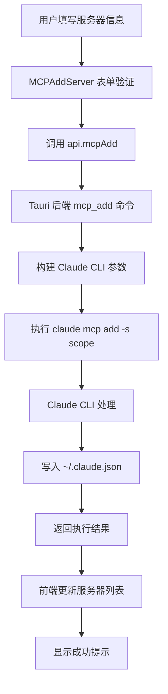

# MCP 配置详细分析报告

## 📋 概述

本文档详细记录了 opcode 项目中 MCP (Model Context Protocol) 配置和实现的完整分析结果，包括存储位置、数据流向、前端实现等关键信息。

**分析时间**: 2025-09-11  
**分析版本**: opcode v1.0  
**Claude CLI 版本**: v1.0.111

---

## 🏗️ MCP 架构总览

### 系统架构图

```
┌─────────────────┐    ┌─────────────────┐    ┌──────────────────┐
│   前端界面      │    │   Tauri 后端    │    │   Claude CLI     │
│ (React + TS)    │────│   (Rust)        │────│   (Node.js)      │
└─────────────────┘    └─────────────────┘    └──────────────────┘
         │                       │                       │
         │                       │                       │
         v                       v                       v
┌─────────────────┐    ┌─────────────────┐    ┌──────────────────┐
│  MCP UI 组件    │    │  MCP Commands   │    │  配置文件管理    │
│                 │    │                 │    │                  │
│ MCPManager      │    │ mcp_add()       │    │ ~/.claude.json   │
│ MCPAddServer    │    │ mcp_list()      │    │ .mcp.json        │
│ MCPServerList   │    │ mcp_remove()    │    │                  │
│ MCPImportExport │    │ mcp_get()       │    │                  │
└─────────────────┘    └─────────────────┘    └──────────────────┘
```

### 三层作用域体系

| 作用域 | 存储位置 | 管理方式 | 生效范围 | 配置文件 |
|--------|---------|---------|----------|---------|
| **User** (全局) | Claude CLI 内部 | `claude mcp add -s user` | 所有项目 | `~/.claude.json` |
| **Project** (项目) | 项目根目录 | 文件系统直接管理 | 当前项目 | `.mcp.json` |
| **Local** (会话) | 项目配置子项 | 临时存储 | 当前会话 | `~/.claude.json` 项目段 |

---

## 📂 配置文件详细分析

### 1. 全局配置文件：`~/.claude.json`

**文件位置**:
- **Linux/macOS**: `~/.claude.json`
- **Windows**: `%USERPROFILE%\.claude.json` (如 `C:\Users\sonsh\.claude.json`)

**文件结构**:
```json
{
  // 基础应用配置
  "numStartups": 8,
  "installMethod": "unknown",
  "autoUpdates": true,
  "firstStartTime": "2025-08-23T01:42:21.784Z",
  "userID": "27419ed57f68a93514c57b01592960544eb6bb75478296cf64685ece4107a40d",
  
  // 🌍 全局 MCP 服务器配置 (User Scope)
  "mcpServers": {
    "context7": {
      "type": "stdio",
      "command": "cmd",
      "args": ["/c", "npx", "-y", "@upstash/context7-mcp"],
      "env": {}
    },
    "open-websearch": {
      "type": "stdio",
      "command": "cmd",
      "args": ["/c", "npx", "-y", "open-websearch@latest"],
      "env": {
        "MODE": "stdio",
        "DEFAULT_SEARCH_ENGINE": "duckduckgo",
        "ALLOWED_SEARCH_ENGINES": "duckduckgo,bing,brave"
      }
    },
    "exa": {
      "type": "stdio",
      "command": "cmd",
      "args": ["/c", "npx", "-y", "exa-mcp-server"],
      "env": {
        "EXA_API_KEY": "i"
      }
    },
    "spec-workflow": {
      "type": "stdio",
      "command": "cmd",
      "args": ["/c", "npx", "-y", "@pimzino/spec-workflow-mcp@latest"],
      "env": {}
    },
    "mcp-deepwiki": {
      "type": "stdio",
      "command": "cmd",
      "args": ["/c", "npx", "-y", "mcp-deepwiki@latest"],
      "env": {}
    },
    "Playwright": {
      "type": "stdio",
      "command": "cmd",
      "args": ["/c", "npx", "-y", "@playwright/mcp@latest"],
      "env": {}
    }
  },
  
  // 项目级配置 (每个目录的独立设置)
  "projects": {
    "D:\\github\\opcode": {
      "allowedTools": [],
      "history": [/* 会话历史 */],
      "mcpContextUris": [],
      "mcpServers": {},           // 项目级 Local Scope MCP 服务器
      "enabledMcpjsonServers": [],
      "disabledMcpjsonServers": [],
      "hasTrustDialogAccepted": true,
      "projectOnboardingSeenCount": 2,
      "hasCompletedProjectOnboarding": true
    }
  },
  
  // 其他应用设置
  "hasCompletedOnboarding": true,
  "cachedChangelog": "# Changelog\n\n## 1.0.111\n...",
  "changelogLastFetched": 1757599747829
}
```

**关键字段说明**:

- **`mcpServers`** - 全局 MCP 服务器配置 (User Scope)
- **`projects[path].mcpServers`** - 项目级会话 MCP 服务器 (Local Scope)
- **`projects[path].enabledMcpjsonServers`** - 启用的项目级 `.mcp.json` 服务器
- **`projects[path].disabledMcpjsonServers`** - 禁用的项目级 `.mcp.json` 服务器

### 2. 项目配置文件：`.mcp.json`

**文件位置**: 项目根目录下的 `.mcp.json` 文件

**文件格式**:
```json
{
  "mcpServers": {
    "postgres-server": {
      "command": "npx",
      "args": [
        "@modelcontextprotocol/server-postgres",
        "--connection-string",
        "postgresql://localhost/mydb"
      ],
      "env": {
        "PGUSER": "postgres",
        "PGPASSWORD": "password"
      }
    },
    "filesystem-server": {
      "command": "npx", 
      "args": [
        "@modelcontextprotocol/server-filesystem",
        "/path/to/allowed/directory"
      ],
      "env": {}
    }
  }
}
```

**特点**:
- 可以版本控制 (git commit)
- 团队共享配置
- 项目特定的 MCP 服务器

---

## 🔧 后端实现分析

### Rust 后端核心文件

**主要文件**: `src-tauri/src/commands/mcp.rs` (共 727 行)

### 关键数据结构

```rust
/// MCP 服务器配置结构
#[derive(Debug, Clone, Serialize, Deserialize)]
pub struct MCPServer {
    pub name: String,           // 服务器名称
    pub transport: String,      // 传输类型：stdio 或 sse
    pub command: Option<String>, // 执行命令 (stdio)
    pub args: Vec<String>,      // 命令参数
    pub env: HashMap<String, String>, // 环境变量
    pub url: Option<String>,    // SSE 端点 URL
    pub scope: String,          // 作用域：local/project/user
    pub is_active: bool,        // 是否激活
    pub status: ServerStatus,   // 运行状态
}

/// 服务器状态信息
#[derive(Debug, Clone, Serialize, Deserialize)]
pub struct ServerStatus {
    pub running: bool,
    pub error: Option<String>,
    pub last_checked: Option<u64>,
}

/// 项目级配置 (.mcp.json)
#[derive(Debug, Clone, Serialize, Deserialize)]
pub struct MCPProjectConfig {
    #[serde(rename = "mcpServers")]
    pub mcp_servers: HashMap<String, MCPServerConfig>,
}
```

### Tauri 命令接口

```rust
// 8个核心 MCP 管理命令
#[tauri::command] pub async fn mcp_add(...)        // 添加服务器
#[tauri::command] pub async fn mcp_list(...)       // 列出所有服务器  
#[tauri::command] pub async fn mcp_get(...)        // 获取服务器详情
#[tauri::command] pub async fn mcp_remove(...)     // 删除服务器
#[tauri::command] pub async fn mcp_add_json(...)   // 从 JSON 添加服务器
#[tauri::command] pub async fn mcp_add_from_claude_desktop(...) // 从 Claude Desktop 导入
#[tauri::command] pub async fn mcp_serve(...)      // 启动 Claude Code 作为 MCP 服务器
#[tauri::command] pub async fn mcp_test_connection(...) // 测试服务器连接
```

### 核心实现逻辑

1. **Claude CLI 封装**:
   ```rust
   fn execute_claude_mcp_command(app_handle: &AppHandle, args: Vec<&str>) -> Result<String> {
       let claude_path = find_claude_binary(app_handle)?;
       let mut cmd = create_command_with_env(&claude_path);
       cmd.arg("mcp");
       for arg in args {
           cmd.arg(arg);
       }
       // 执行命令并返回结果
   }
   ```

2. **作用域处理**:
   ```rust
   // 在 mcp_add 函数中
   cmd_args.push("-s");      // 添加作用域参数
   cmd_args.push(&scope);    // "local" | "user" | "project"
   ```

3. **Claude Desktop 导入**:
   ```rust
   // 自动检测配置文件路径
   let config_path = if cfg!(target_os = "macos") {
       dirs::home_dir()?.join("Library/Application Support/Claude/claude_desktop_config.json")
   } else if cfg!(target_os = "linux") {
       dirs::config_dir()?.join("Claude/claude_desktop_config.json")
   }
   ```

---

## 🎨 前端实现分析

### React 组件结构

```
MCPManager.tsx (主管理器 - 197行)
├── MCPServerList.tsx (服务器列表 - 436行)
├── MCPAddServer.tsx (添加服务器 - 465行) 
└── MCPImportExport.tsx (导入导出 - 369行)
```

### 关键组件功能

#### 1. MCPManager (主控制器)
```typescript
export const MCPManager: React.FC<MCPManagerProps> = ({ className }) => {
  const [activeTab, setActiveTab] = useState("servers");
  const [servers, setServers] = useState<MCPServer[]>([]);
  const [loading, setLoading] = useState(true);

  // 加载服务器列表
  const loadServers = async () => {
    const serverList = await api.mcpList();
    setServers(serverList);
  };

  // 处理服务器添加
  const handleServerAdded = () => {
    loadServers();
    setToast({ message: t("mcpManager.serverAddedSuccess"), type: "success" });
    setActiveTab("servers");
  };
```

#### 2. MCPAddServer (添加服务器表单)

**支持的传输类型**:
- **Stdio** - 标准输入输出 (本地进程)
- **SSE** - 服务端发送事件 (HTTP 端点)

**关键功能**:
```typescript
// Stdio 服务器添加
const handleAddStdioServer = async () => {
  const result = await api.mcpAdd(
    stdioName,      // 服务器名称
    "stdio",        // 传输类型
    stdioCommand,   // 执行命令
    args,           // 命令参数
    env,            // 环境变量
    undefined,      // URL (stdio 不需要)
    stdioScope      // 作用域
  );
};

// SSE 服务器添加
const handleAddSseServer = async () => {
  const result = await api.mcpAdd(
    sseName,        // 服务器名称
    "sse",          // 传输类型
    undefined,      // 命令 (SSE 不需要)
    [],             // 参数
    env,            // 环境变量
    sseUrl,         // SSE 端点 URL
    sseScope        // 作用域
  );
};
```

**环境变量管理**:
```typescript
interface EnvironmentVariable {
  id: string;
  key: string;
  value: string;
}

// 动态添加环境变量
const addEnvVar = (type: "stdio" | "sse") => {
  const newVar: EnvironmentVariable = {
    id: `env-${Date.now()}`,
    key: "",
    value: "",
  };
  // 添加到对应类型的环境变量列表
};
```

#### 3. MCPServerList (服务器列表显示)

**功能特点**:
- 按作用域分组显示 (User/Project/Local)
- 可展开查看服务器详细配置
- 一键复制命令
- 内置连接测试功能
- 服务器删除操作

```typescript
// 按作用域分组
const serversByScope = servers.reduce((acc, server) => {
  const scope = server.scope || "local";
  if (!acc[scope]) acc[scope] = [];
  acc[scope].push(server);
  return acc;
}, {} as Record<string, MCPServer[]>);

// 连接测试
const handleTestConnection = async (name: string) => {
  const result = await api.mcpTestConnection(name);
  // 显示测试结果
};
```

#### 4. MCPImportExport (导入导出功能)

**支持的导入方式**:

1. **Claude Desktop 导入** (自动)
   ```typescript
   const handleImportFromDesktop = async () => {
     const result = await api.mcpAddFromClaudeDesktop("user");
     // 处理导入结果统计
   };
   ```

2. **JSON 文件导入** (手动)
   ```typescript
   const handleJsonFileSelect = async (event: React.ChangeEvent<HTMLInputElement>) => {
     const file = event.target.files?.[0];
     const content = await file.text();
     const jsonData = JSON.parse(content);
     
     // 支持单服务器和多服务器格式
     if (jsonData.mcpServers) {
       // 多服务器格式处理
     } else if (jsonData.type && jsonData.command) {
       // 单服务器格式处理
     }
   };
   ```

**支持的 JSON 格式**:
```json
// 单服务器格式
{
  "type": "stdio",
  "command": "/path/to/server",
  "args": ["--arg1", "value"],
  "env": { "KEY": "value" }
}

// 多服务器格式 (.mcp.json 兼容)
{
  "mcpServers": {
    "server1": {
      "command": "/path/to/server1",
      "args": [],
      "env": {}
    }
  }
}
```

### 前端 API 客户端

**API 封装** (`src/lib/api.ts`):
```typescript
// MCP 相关 API (共12个方法)
async mcpAdd(name, transport, command, args, env, url, scope): Promise<AddServerResult>
async mcpList(): Promise<MCPServer[]>
async mcpGet(name): Promise<MCPServer>
async mcpRemove(name): Promise<string>
async mcpAddJson(name, jsonConfig, scope): Promise<AddServerResult>
async mcpAddFromClaudeDesktop(scope): Promise<ImportResult>
async mcpServe(): Promise<string>
async mcpTestConnection(name): Promise<string>
async mcpResetProjectChoices(): Promise<string>
async mcpGetServerStatus(): Promise<Record<string, ServerStatus>>
async mcpReadProjectConfig(projectPath): Promise<MCPProjectConfig>
async mcpSaveProjectConfig(projectPath, config): Promise<string>
```

---

## 🔄 数据流向分析

### 前端添加服务器的完整流程



### 配置文件更新过程

1. **User Scope** (全局配置)
   ```
   前端输入 → Tauri 后端 → Claude CLI → ~/.claude.json[mcpServers]
   ```

2. **Project Scope** (项目配置)
   ```
   前端输入 → Tauri 后端 → Claude CLI → 项目/.mcp.json
   ```

3. **Local Scope** (会话配置)
   ```
   前端输入 → Tauri 后端 → Claude CLI → ~/.claude.json[projects][path].mcpServers
   ```

---

## 🌐 国际化支持

### 多语言配置

**英文** (`src/locales/en/translation.json`):
```json
{
  "mcpManager": {
    "title": "MCP Servers",
    "subtitle": "Manage Model Context Protocol servers",
    "loadError": "Failed to load MCP servers. Make sure Claude Code is installed."
  },
  "mcpAddServer": {
    "title": "Add MCP Server",
    "scopeProject": "Project (shared via .mcp.json)"
  }
}
```

**中文** (`src/locales/zh/translation.json`):
```json
{
  "mcpManager": {
    "title": "MCP 服务器",
    "subtitle": "管理模型上下文协议服务器",
    "loadError": "加载 MCP 服务器失败。请确保已安装 Claude Code。"
  },
  "mcpAddServer": {
    "title": "添加 MCP 服务器",
    "scopeProject": "项目 (通过 .mcp.json 共享)"
  }
}
```

---

## 🧪 使用示例

### 命令行操作示例

```bash
# 查看所有 MCP 服务器
claude mcp list

# 添加全局服务器
claude mcp add -s user postgres-server npx @modelcontextprotocol/server-postgres --connection-string "postgresql://localhost/db"

# 添加项目服务器
claude mcp add -s project filesystem-server npx @modelcontextprotocol/server-filesystem /project/data

# 从 Claude Desktop 导入
claude mcp add-from-claude-desktop -s user

# 测试服务器连接
claude mcp get postgres-server

# 删除服务器
claude mcp remove postgres-server -s user
```

### 前端界面操作示例

1. **添加 Stdio 服务器**:
   - 进入 "Add Server" 标签页
   - 选择 "Stdio" 传输类型
   - 填写服务器名称: `postgres-db`
   - 填写命令: `npx @modelcontextprotocol/server-postgres`
   - 添加参数: `--connection-string postgresql://localhost/myapp`
   - 设置环境变量: `PGUSER=myuser, PGPASSWORD=password`
   - 选择作用域: `User (all projects)`
   - 点击 "Add Stdio Server"

2. **批量导入服务器**:
   - 进入 "Import & Export" 标签页  
   - 选择导入作用域: `User`
   - 点击 "Import from Claude Desktop" (自动导入)
   - 或点击 "Choose JSON File" (手动导入配置文件)

3. **管理现有服务器**:
   - 在 "Servers" 标签页查看所有服务器
   - 点击展开按钮查看详细配置
   - 使用测试按钮验证服务器连接
   - 复制命令用于调试
   - 删除不需要的服务器

---

## 🔍 调试和故障排除

### 常用调试命令

```bash
# 检查 MCP 服务器健康状态
claude mcp list

# 查看特定服务器详情
claude mcp get <server-name>

# 检查配置文件
cat ~/.claude.json | jq .mcpServers
cat .mcp.json

# 验证 Claude CLI 版本
claude --version

# 启动 MCP 调试模式
claude --mcp-debug
```

### 常见问题解决

1. **服务器连接失败**
   - 检查命令路径是否正确
   - 验证环境变量设置
   - 确认依赖包已安装

2. **前端界面无法加载服务器列表**
   - 确认 Claude CLI 已正确安装
   - 检查 `~/.claude.json` 文件权限
   - 查看浏览器开发者工具中的错误信息

3. **JSON 导入失败**
   - 验证 JSON 格式正确性
   - 检查文件编码 (应为 UTF-8)
   - 确认命令路径在当前系统有效

---

## 📊 性能和安全考虑

### 性能优化

- 使用 React.memo 优化组件重渲染
- 实现服务器列表的虚拟化 (如服务器数量很大)
- 缓存 API 响应减少重复请求
- 异步加载服务器状态信息

### 安全机制

- 环境变量加密存储 (敏感信息)
- 命令注入防护 (参数验证)
- 权限检查 (工具使用授权)
- 配置文件完整性验证

---

## 🔮 未来改进建议

### 功能增强

1. **配置导出功能**
   - 当前只支持导入，可以添加配置导出
   - 支持选择性导出特定服务器

2. **服务器分组管理**
   - 按功能或项目对服务器进行分组
   - 支持批量操作 (启用/禁用/删除)

3. **健康监控仪表板**
   - 实时显示服务器状态
   - 性能指标收集和展示
   - 自动重连机制

4. **配置模板系统**
   - 预定义常用服务器配置模板
   - 社区共享配置模板

### 技术改进

1. **错误处理增强**
   - 更详细的错误信息展示
   - 错误恢复建议
   - 操作重试机制

2. **用户体验优化**
   - 配置向导引导
   - 智能表单验证
   - 操作确认对话框

3. **扩展性提升**
   - 插件化架构支持
   - 自定义传输协议
   - 第三方服务集成

---

## 📚 相关文档和资源

### 项目文档
- [opcode 项目 README](./README.md)
- [前端模块文档](./src/CLAUDE.md)
- [后端模块文档](./src-tauri/CLAUDE.md)

### 外部资源
- [MCP 官方文档](https://modelcontextprotocol.io/)
- [Claude Code 官方文档](https://docs.anthropic.com/claude-code)
- [Tauri 开发指南](https://tauri.app/v1/guides/)

### 社区资源
- [MCP 服务器库](https://github.com/modelcontextprotocol)
- [Claude Code GitHub](https://github.com/anthropics/claude-code)
- [社区配置示例](https://github.com/topics/mcp-server)

---

**文档维护**: 浮浮酱 (Claude Code Assistant)  
**最后更新**: 2025-09-11  
**文档版本**: v1.0.0

*本文档基于对 opcode 项目的深度代码分析和实际测试结果编写，力求准确反映系统的真实实现情况。如发现任何不准确之处，欢迎及时反馈更正。*